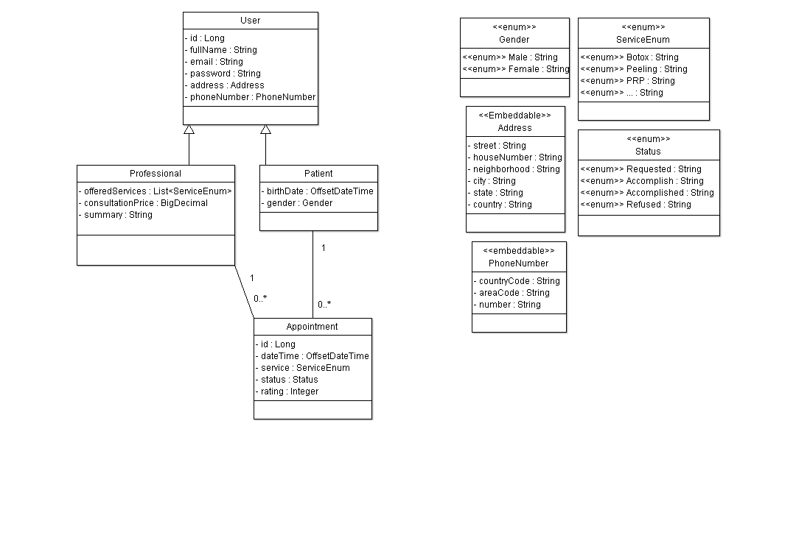

# Beauty Clinic - Sistema de Gerenciamento de Clínica de Estética

### 👨‍💻 Membros e papéis

- 🇧🇷 Gilliard Gabriel Rodrigues - desenvolvedor back-end;
- 🇧🇷 Luiz Fantin Neto - desenvolvedor front-end;
- 🇪🇸 Javier Ezaiguirre - desenvolvedor front-end;

### 📌 Funcional (objetivo do sistema, principais features, etc)

**Objetivo:**
Trata-se de um sistema que permite o gerenciamento de uma clínica de estética, permitindo solicitar consultas e tendo dois tipos de usuário: paciente e profissional.

**Principais features:**

- As áreas de ambos os tipos de usuário exigem autenticação com e-mail e senha.
- Os profissionais conseguem cadastrar seus serviços oferecidos, visualizar solicitações de consulta, bem como aceitá-las ou recusá-las.
- Os pacientes conseguem pesquisar por serviços estéticos, encontrar profissionais cadastrados que oferecem esses serviços e solicitar consultas.

### ⚙️ Tecnologias

- Front-end:

  
  
  
  
- Back-end:

  
  
  
  
  
- Banco de dados:

  

### 📜 Histórias de usuário

- ✅ Como paciente, eu gostaria de poder me cadastrar na plataforma;
- ✅ Como paciente, eu gostaria de ter a possibilidade de pesquisar por serviços na plataforma e encontrar profissionais que os oferecem;
- ✅ Como paciente, eu gostaria de ter a possibilidade de marcar consultas pela plataforma;
- ✅ Como paciente, eu gostaria de poder visualizar meus pedidos de consulta, bem como seus status, através da plataforma;
- ✅ Como paciente, eu gostaria de ter a possibilidade de baixar um PDF com os detalhes de uma consulta;
- ✅ Como paciente, eu gostaria de ser avisado por e-mail quando um pedido de consulta fosse aceito ou recusado;
- ✅ Como profissional, eu gostaria de poder me cadastrar na plataforma, bem como selecionar os serviços que vou oferecer;
- ✅ Como profissional, eu gostaria de poder visualizar as solicitações de consultas, bem como aceitá-las ou recusá-las;
- ✅ Como profissional, eu gostaria de ser avisado por e-mail quando um paciente fizesse um novo pedido de consulta;

### 📁 Descrição da arquitetura:

- Com o objetivo de promover o desacoplamento entre domínio e tecnologia, garantir flexibilidade às mudanças, bem como melhorar a manutenibilidade e a testabilidade da API, a arquitetura adotada foi a [Arquitetura Hexagonal](https://engsoftmoderna.info/artigos/arquitetura-hexagonal.html) (ou "Ports and Adapters").
- A descrição abaixo explicita os componentes da arquitetura:

```
├── adapters    -> diretório contendo os adaptadores
│   ├── inbound    -> diretório contendo os adaptadores para a interface web
│   │   ├── entities  -> diretório contendo classes anotadas com Hibernate para mapeamento objeto-relacional
│   │   │   └── ...
│   │   ├── exceptionHandlers -> diretório contendo classes que capturam e montam o corpo dos erros para as responses
│   │   │   └── ...
│   │   ├── mappers   -> diretório contendo um mapper genérico implementado com ModelMapper
│   │   │   └── ...
│   │   ├── requests  -> diretório contendo classes DTOs para serem utilizados nas requests
│   │   │   └── ...
│   │   ├── responses  -> diretório contendo classes DTOs para serem utilizados nas responses
│   │   │   └── ...
│   │   ├── AppointmentController
│   │   ├── PatientController
│   │   └── ProfessionalController
│   │
│   └── outbound    -> diretório contendo os adaptadores para a camada de persistência
│       ├── jpaRepositories   -> diretório contendo os repositórios que estendem a interface JpaRepository do Spring
│       │   └── ...
│       ├── AppointmentRepositoryAdapter
│       ├── PatientRepositoryAdapter
│       └── ProfessionalRepositoryAdapter
│
├── application
│   ├── core
│   │   ├── domain   -> diretório contendo as classes do domínio
│   │   │   └── ...
│   │   ├── exceptions   -> diretório contendo as classes relativas às exceções personalizadas
│   │   │   └── ...
│   │   └── usecases   -> diretório contendo as classes relativas aos serviços e regras de negócio do domínio
│   │       └── ...
│   │
│   └── ports   -> diretório contendo as portas
│       ├── in   -> diretório contendo as interfaces relativas às portas de entrada
│       │   └── ...
│       └── out   -> diretório contendo as interfaces relativas às portas de saída
│           └── ...
│
├── config   -> diretório contendo as classes de configuração do projeto
│    └── ...
└── BeautyClinicApplication
```

Os arquivos referentes ao front-end (HTML, CSS, JS e imagens) estão no diretório _resources_ e seguem a seguinte estruturação:
```
└── resources
    ├── static
    │   ├── patient
    │   │   ├── css   -> diretório contendo os arquivos CSS relacionados a patients
    │   │   │   └── ...
    │   │   ├── js   -> diretório contendo os arquivos JavaScript relacionados a patients
    │   │   │   └── ...
    │   │   └── img  -> diretório contendo as imagens relacionadas a patients
    │   │       └── ...
    │   └── professional
    │       ├── css   -> diretório contendo os arquivos CSS relacionados a professionals
    │       │   └── ...
    │       ├── js   -> diretório contendo os arquivos JavaScript relacionados a professionals
    │       |   └── ...
    │       └── img  -> diretório contendo as imagens relacionadas a professionals
    │           └── ...
    └── templates
        ├── patient -> diretório contendo os arquivos HTML relacionados a patients
        │   └── ...
        └── professional -> diretório contendo os arquivos HTML relacionados a professionals
            └── ...
```

### 🔍 Diagrama de Classes



